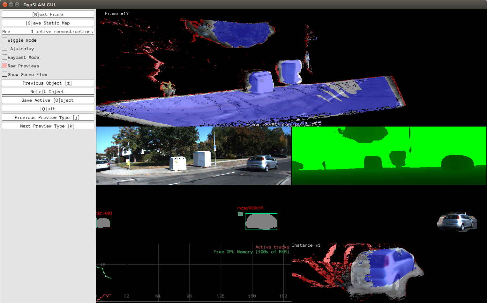

# DynSLAM: Simultaneous Localization and Mapping in Dynamic Environments

This is a dense SLAM system written in C++. It builds on [InfiniTAM](https://github.com/victorprad/InfiniTAM), adding support
for stereo input, outdoor operation, voxel garbage collection,
and separate dynamic object (e.g., car) reconstruction.

Developed as part of my Master's Thesis, in the [Computer
Vision and Geometry Group](https://cvg.ethz.ch) of [ETH
Zurich](https://ethz.ch). Submitted to ICRA 2018 accompanying
the paper "Robust Dense Mapping for Large-Scale Dynamic 
Environments".

The source code is [hosted on GitHub](https://github.com/AndreiBarsan/DynSLAM).

## Preview

The following screenshot shows an early preview of DynSLAM in action. It
takes in stereo input, computes the depth map, using either ELAS or
dispnet, segments the input RGB using Multi-task Network Cascades to
detect object instances, and then separately reconstructs the static
background and individual object instances.

The top pane shows the dense reconstruction of the background. The
following panes show, in top-down, left-right order: the left RGB frame,
the computed depth map, the output of the instance-aware semantic
segmentation algorithm, the input RGB to the instance reconstructor,
memory usage statistics, and a novel view of the reconstructed object
instance.

The colors in the 3D reconstructions correspond to the voxel weights:
red-tinted areas are low-weight ones, whereas blue ones are high-weight
ones. Areas which remain low-weight even several frames after first
being observed are very likely to be noisy, while blue ones are ones
where the system is confident in its reconstruction.



## Related Repositories

 * [My InfiniTAM fork](https://github.com/AndreiBarsan/InfiniTAM), which
   is used by this system for the actual 3D reconstruction (via
   volumetric fusion, using voxel hashing for map storage). My fork
   contains a series of small tweaks designe to make InfiniTAM a little
   easier to use as a component of a larger system.
 * [My fork of the official implemntation of Multi-task Network Cascades](https://github.com/AndreiBarsan/MNC)
    for image semantic segmentation. We need this for identifying where
    the cars are in the input videos. Using semantics enables us to
    detect both moving and static cars.
 * [My fork of the modified Caffe used by MNC](https://github.com/AndreiBarsan/caffe-mnc). Since MNC's architecture requires
 some tweaks to Caffe's internals, its authors forked Caffe and modified
 it to their needs. I forked their fork and made it work with my tools,
 while also making it faster by merging it with the Caffe master, which
 enabled cuDNN 5 support, among many other things.
  * [My mirror of libelas](https://github.com/AndreiBarsan/libelas-tooling)
  which I use for pre-computing the depth maps. I'm working on getting
  the depth computation to happen on the fly, and investigating other
  methods for estimating depth from stereo.

### Installation Pointers

If you want to check out the system very quickly, you're in luck!
There's a pre-preprocessed sequence you can download to see how it works.

If you want to run on any KITTI sequence, there are a few additinal
steps. The pipeline depends on two different neural networks implemented
in Caffe to perform semantic segmentation and disparity estimation from
stere. As such, it is a bit time-consuming to get preprocessing
running. I plan on improving this process. See [this issue](https://github.com/AndreiBarsan/DynSLAM/issues/15)!

Important: if you're interested in this project and it's after January 1st
2018, please email me! My email is on my GitHub profile page. I will update the
instructions accordingly. Reproducibility is VERY important to me.

Note that the system is under *heavy* development at the moment, so that these
instructions could quickly go out of date. Generally speaking, this project is
built using CMake, and it depends on several submodules. As such, make sure you
don't forget the `--recursive` flag when cloning the repository. If you did
forget it, just run `git submodule update --init --recursive`.

 1. Clone the repository if you haven't already:
    ```bash
    git clone --recursive https://github.com/AndreiBarsan/DynSLAM
    ```
 1. Install OpenCV 2.4.9 and CUDA (no special version requirements at the moment).
 1. Install the "easy" prerequisites (Ubuntu example):
    ```bash
    sudo apt-get install libxmu-dev libxi-dev freeglut3 freeglut3-dev glew-utils libglew-dev libglew-dbg
    ```
 1. CMake refuses to use the in-tree Eigen for some reason, but it's OK to install it from your package manager. DynSLAM doesn't need a super up-to-date version.
    ```bash
    sudo apt install libeigen3-dev
    ```
 1. Build Pangolin to make sure it gets put into the CMake registry:
    ```bash
    cd src/Pangolin && mkdir build/ && cd $_ && cmake ../ && make -j8
    ```
 1. Build the project in the standard CMake fashion:
    ```bash
    mkdir build && cd build && cmake .. && make -j
    ```
 1. Try processing the demo sequence: It's a bit annoying to preprocess a KITTI sequence for the system,
    so [here is a short sample from KITTI Odometry Sequence 06](http://www.cs.toronto.edu/~iab/dynslam/mini-kitti-odometry-seq-06-for-dynslam.7z).
      1. Extract that to a directory, and run DynSLAM on it (the mkdir circumvents a silly bug):
        ```bash
        mkdir -p csv/ && build/DynSLAM --use_dispnet --dataset_root=path/to/extracted/archive
        ```
 1. Run on arbitrary video sequences: The system can run on any KITTI Odometry and Tracking sequence. Raw sequences
 should also work, but have not been tested since the evaluation is trickier, as their LIDAR data is not
 cleaned up to account for the rolling shutter effect. 
    1. Grab the KITTI Odometry dataset [from the official website](www.cvlibs.net/datasets/kitti/eval_odometry.php).
    Make sure you download everything and extract it all in the same directory (see the demo sequence archive
    for the canonical directory structure, or `Input.h` to see how DynSLAM loads it).
    1. Use the [MNC pre-trained neural network](http://github.com/AndreiBarsan/MNC)
       to process the KITTI sequence. In the future, this will be integrated into
       the main pipeline but right now Caffe is a bit capricious.
       Please see `Input.h` for the appropriate directory structure and where to put the semantic segmentations.  
    1. Precompute DispNet disparity maps using [the DispNet docker image](https://github.com/lmb-freiburg/dispnet-flownet-docker).
       Please see `Input.h` for the appropriate directory structure and where to put the disparity maps.
    1. Run the pipeline on the KITTI sequence you downloaded.
       ```bash
       ./DynSLAM --use_dispnet --dataset_root=path/to/kitti/sequence
       ```
 
 You can also use `DynSLAM --help` to view info on additional commandline arguments. (There are a lot of them!)

## Remarks

  * The code follows
    [Google's C++ style guide](https://google.github.io/styleguide/cppguide.html)
    with the following modifications:

    * The column limit is 100 instead of 80, because of the bias towards
      longer type names in the code base.
    * Exceptions are allowed, but must be used judiciously (i.e., for
      serious errors and exceptional situations).
